


 

 

Estoy terminando **Ingeniería de Sistemas y Computación en la Universidad de los Andes** y hago el **coterminal de la Maestría en Ingeniería de Software (MISO)**. Me gusta construir el sistema completo: el motor que hace el trabajo difícil (un raycaster, un solver de óptica, un grafo de agentes) y la interfaz que lo vuelve fácil de usar. Y después probarlo de punta a punta, porque si no tiene pruebas no está terminado.

- **Ahora mismo:** mi proyecto de grado, una suite E2E para el sistema de ajuste de horario de Uniandes.
- **Lo que más disfruto:** agentes con LLM que delegan y se controlan entre sí, física y 3D en el navegador, y herramientas para enseñar a programar.
- **Cómo trabajo:** arquitectura limpia (puertos y adaptadores), decisiones documentadas y CI en verde antes de entregar.

 

## Proyectos destacados

  
  

  <a href="https://creaspider.vercel.app"></a>
  <a href="https://recrea-pi.vercel.app"></a>

  
  

  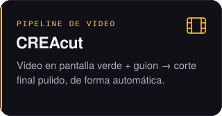
  <a href="https://github.com/CREA-Ingenieria/Cansat-SOFTWARE">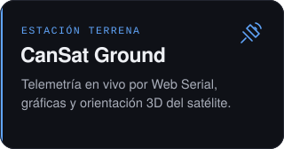</a>
  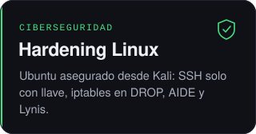

Varios de estos repositorios son privados porque pertenecen a cursos o a la universidad. Si quieres ver el código o una demo, escríbeme.

 

## Este semestre · 2026-20

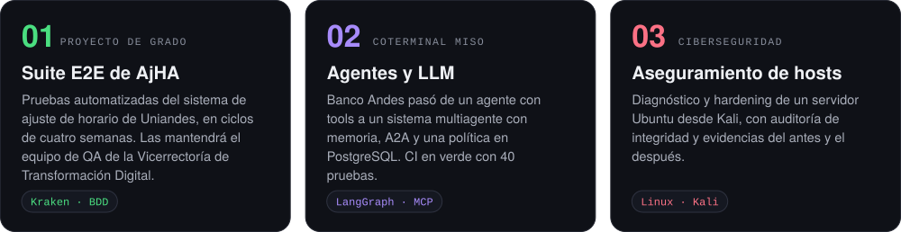

 

## Stack

  
   
  

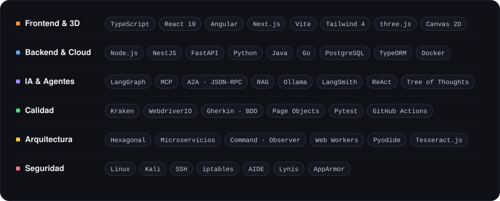

 

